# 🔒 FortiGate — Security Lab 2174

**Laboratorio de Seguridad de Redes — FortiGate / GNS3**

> Implementación de una topología segmentada con FortiGate, switch L2, una VLAN de usuarios y dos VLAN de servidores. El laboratorio aplica políticas de acceso, NAT, HTTPS, MariaDB, IPS para SQL Injection, cuarentena de atacantes, filtrado de ejecutables y protección DoS.

---

## 🎬 Video de demostración

> **Video:** [Ver demostración en YouTube](PENDIENTE)

> El enlace final del video debe mantenerse al inicio del repositorio, como exige la tarea.

---

## 📑 Tabla de contenido

1. [Objetivo del laboratorio](#-objetivo-del-laboratorio)
2. [Cumplimiento de requisitos](#-cumplimiento-de-requisitos)
3. [Topología y direccionamiento](#-topología-y-direccionamiento)
4. [Componentes del entorno](#-componentes-del-entorno)
5. [Funcionamiento de la configuración](#-funcionamiento-de-la-configuración)
6. [Políticas de FortiGate](#-políticas-de-fortigate)
7. [Perfiles de seguridad](#-perfiles-de-seguridad)
8. [Configuración del switch](#-configuración-del-switch)
9. [Servidores](#-servidores)
10. [Validación de la implementación](#-validación-de-la-implementación)
11. [Capturas de pantalla](#-capturas-de-pantalla)
12. [Archivos del repositorio](#-archivos-del-repositorio)
13. [Limitaciones observadas](#-limitaciones-observadas)

---

## 🎯 Objetivo del laboratorio

Implementar una infraestructura de red segmentada y protegida mediante un firewall FortiGate, utilizando VLANs para separar usuarios, servidor web y servidor de base de datos.

El firewall controla la comunicación entre segmentos, proporciona salida a Internet mediante NAT, restringe el acceso al servidor web a HTTPS, impide conexiones directas de los usuarios hacia la base de datos y permite que el servidor web se comunique con MariaDB únicamente mediante TCP/3306.

También se implementan mecanismos de seguridad adicionales: IPS con una firma personalizada para SQL Injection, cuarentena de la IP atacante, filtrado de archivos ejecutables, Application Control y una política DoS con umbrales para limitar floods y escaneos.

---

## ✅ Cumplimiento de requisitos

| Requisito | Implementación |
|---|---|
| FortiGate configurado por GUI | FortiGate-VM64-KVM administrado mediante GUI |
| Ruta por defecto | WAN `port1` obtiene gateway por DHCP desde NAT1 |
| NAT | Política `USUARIOS-TO-INTERNET` con NAT habilitado |
| Política 1: Usuarios → WEB 443 | `USUARIOS-TO-WEB-HTTPS`, servicio HTTPS |
| Política 2: bloquear Usuarios → DB 3306 | `BLOCK-USUARIOS-TO-DB-3306`, acción DENY |
| DPI | Perfil `custom-deep-inspection` configurado en la política hacia WEB |
| Detección SQL Injection | Firma IPS personalizada `SQLI-2174` |
| Bloqueo SQL Injection | Sensor `SQLI-QUARANTINE-2174` |
| Cuarentena del atacante | Acción `Quarantine`, IP observada como `Banned IP` |
| WEB → DB solo TCP/3306 | `WEB-TO-DB-MYSQL` + `BLOCK-WEB-TO-DB-OTHER` |
| Bloqueo de `.exe` | File Filter `BLOCK-EXE-2174` |
| Filtrado de aplicaciones | `APP-CONTROL-USUARIOS-2174` |
| Rate limiting / DoS | `DOS-PROTECTION-WEB-2174` |
| Switch con VLANs | VLAN 10, 20 y 30 + trunk 802.1Q |
| Seguridad básica del switch | Port Security Sticky + modo restrict |
| 2 servidores `/28` | WEB `10.21.74.130/28`, DB `10.21.74.146/28` |
| Usuarios `/25` | VLAN 10 `10.21.74.0/25` |
| DHCP | Rango configurado en VLAN 10 |
| WEB Server HTTPS | Apache2 en TCP/443 |
| DB Server | MariaDB en TCP/3306 |
| Scripts utilizados | Directorio `scripts/` |
| Running-configs | Directorio `files/` |
| Capturas y diagramas | Directorio `images/` |

---

## 🗺️ Topología y direccionamiento
La siguiente imagen muestra la topología implementada en GNS3:

<p align="center">
  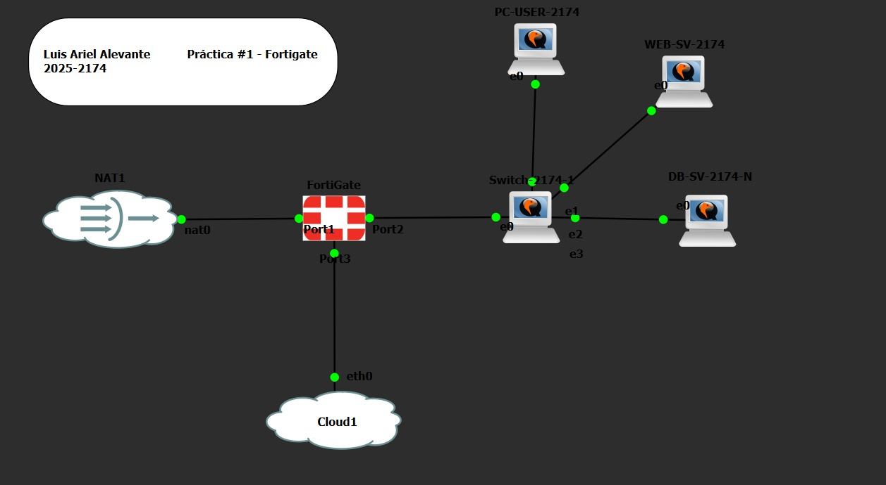
</p>

### Tabla de direccionamiento

| Dispositivo / Red | Interfaz | Dirección | Función |
|---|---|---:|---|
| FortiGate WAN | `port1` | DHCP (`192.168.42.x/24` durante el laboratorio) | Salida a NAT1/Internet |
| FortiGate trunk | `port2` | Sin IP física | Transporte VLAN 10, 20 y 30 |
| FortiGate administración | `port3` | `192.168.79.99/24` | Acceso GUI |
| VLAN 10 USUARIOS | `port2.10` | `10.21.74.1/25` | Gateway de usuarios |
| VLAN 20 WEB | `port2.20` | `10.21.74.129/28` | Gateway WEB |
| VLAN 30 DATABASE | `port2.30` | `10.21.74.145/28` | Gateway DB |
| PC-USER-2174 | `ens3` | DHCP, ej. `10.21.74.10/25` | Cliente de pruebas |
| WEB-SV-2174 | `ens3` | `10.21.74.130/28` | Apache HTTPS |
| DB-SV-2174 | `ens3` | `10.21.74.146/28` | MariaDB |

### VLANs

| VLAN | Nombre | Red | Gateway |
|---:|---|---|---|
| 10 | USUARIOS | `10.21.74.0/25` | `10.21.74.1` |
| 20 | WEB | `10.21.74.128/28` | `10.21.74.129` |
| 30 | DATABASE | `10.21.74.144/28` | `10.21.74.145` |

---

## 🧩 Componentes del entorno

| Componente | Descripción |
|---|---|
| Emulador | GNS3 |
| Firewall | FortiGate-VM64-KVM / FortiOS 7.0.9 |
| Switch | Cisco IOSvL2 / switch L2 |
| Usuario | Ubuntu Server usado como cliente |
| WEB Server | Ubuntu + Apache2 + HTTPS |
| DB Server | Ubuntu + MariaDB |
| Administración FortiGate | `http://192.168.79.99:8080` mediante VMware VMnet1 |

---

## 🔬 Funcionamiento de la configuración

### Segmentación
El enlace entre `port2` del FortiGate y `Gi0/0` del switch funciona como trunk 802.1Q y transporta VLAN 10, 20 y 30.

- `Gi0/1` → VLAN 10 — USUARIOS
- `Gi0/2` → VLAN 20 — WEB
- `Gi0/3` → VLAN 30 — DATABASE

### Internet y NAT
`USUARIOS-TO-INTERNET` permite la salida de VLAN 10 mediante NAT. Las policies `TEMP-WEB-TO-INTERNET` y `TEMP-DB-TO-INTERNET` se usaron únicamente para instalaciones y quedan deshabilitadas al final.

### Usuarios → WEB
`USUARIOS-TO-WEB-HTTPS` permite solamente HTTPS/TCP 443 desde Usuarios hacia `WEB-SERVER`.

### Usuarios → DB
`BLOCK-USUARIOS-TO-DB-3306` bloquea MYSQL/TCP 3306 desde Usuarios hacia `DB-SERVER`.

### WEB → DB
`WEB-TO-DB-MYSQL` permite TCP/3306 y `BLOCK-WEB-TO-DB-OTHER` bloquea cualquier otro tráfico entre ambos servidores.

### SQL Injection
Se creó `SQLI-2174` dentro del sensor `SQLI-QUARANTINE-2174`, con acción `Quarantine` y Packet Logging.

La validación controlada usa una policy HTTP temporal. FortiGate muestra **Attack Detected** y `10.21.74.10` aparece en **Quarantine Monitor / Banned IP** con origen `IPS`.

### Filtrado de ejecutables
El perfil `BLOCK-EXE-2174` bloquea ejecutables descargados mediante HTTP. `APP-CONTROL-USUARIOS-2174` complementa la política de acceso a Internet.

### Protección DoS
`DOS-PROTECTION-WEB-2174` utiliza estos umbrales:

| Anomalía | Acción | Threshold |
|---|---|---:|
| `tcp_syn_flood` | Block | 100 |
| `tcp_port_scan` | Block | 50 |
| `tcp_src_session` | Block | 100 |
| `tcp_dst_session` | Block | 200 |
| `icmp_flood` | Block | 50 |

---

## 🔥 Políticas de FortiGate

| Política | Origen → Destino | Servicio | Acción | NAT |
|---|---|---|---|---|
| `USUARIOS-TO-INTERNET` | VLAN10 → WAN | ALL | ACCEPT | ON |
| `USUARIOS-TO-WEB-HTTPS` | VLAN10 → WEB | HTTPS | ACCEPT | OFF |
| `BLOCK-USUARIOS-TO-DB-3306` | VLAN10 → DB | MYSQL | DENY | OFF |
| `WEB-TO-DB-MYSQL` | WEB → DB | MYSQL | ACCEPT | OFF |
| `BLOCK-WEB-TO-DB-OTHER` | WEB → DB | ALL | DENY | OFF |
| `TEMP-WEB-TO-INTERNET` | WEB → WAN | ALL | ACCEPT | ON — **DISABLED** |
| `TEMP-DB-TO-INTERNET` | DB → WAN | ALL | ACCEPT | ON — **DISABLED** |
| `TEST-SQLI-HTTP-2174` | VLAN10 → WEB | HTTP | ACCEPT | OFF — **TEMPORAL/DISABLED** |
| `TEST-BLOCK-EXE-2174` | VLAN10 → WEB | HTTP | ACCEPT | OFF — **TEMPORAL/DISABLED AL FINAL** |

---

## 🛡️ Perfiles de seguridad

### IPS
**Sensor:** `SQLI-QUARANTINE-2174`

**Custom Signature:** `SQLI-2174`

```text
F-SBID( --name "SQLI.2174"; --severity high; --protocol tcp; --flow from_client; --pattern "%20UNION%20SELECT%20"; --context PACKET_ORIGIN; --no_case; )
```

Acción: `Quarantine`  
Packet Logging: `Enabled`

### File Filter
**Perfil:** `BLOCK-EXE-2174`

- Protocolo: HTTP
- Dirección: Incoming
- File Type: EXE
- Acción: Block

### Application Control
**Perfil:** `APP-CONTROL-USUARIOS-2174`

- P2P → Block
- Proxy → Block
- otras categorías → Monitor/Pass según configuración
- QUIC → Block

### SSL Inspection
`custom-deep-inspection` quedó configurado para la policy HTTPS. En esta instancia se observó que el cliente seguía recibiendo el certificado autofirmado original del WEB Server, por lo que la prueba funcional del IPS/SQLi se realizó mediante una policy HTTP temporal controlada.

### DoS
**Policy:** `DOS-PROTECTION-WEB-2174`

---

## 🔀 Configuración del switch

```text
Gi0/0 → TRUNK hacia FortiGate
Gi0/1 → ACCESS VLAN 10
Gi0/2 → ACCESS VLAN 20
Gi0/3 → ACCESS VLAN 30
```

Trunk permitido:

```text
10,20,30
```

Seguridad básica:

- máximo 1 MAC por puerto de acceso
- Sticky MAC
- violation mode `restrict`

---

## 🖥️ Servidores

### WEB-SV-2174
```text
IP:      10.21.74.130/28
Gateway: 10.21.74.129
Servicio: Apache2 HTTPS
Puerto:  443/TCP
```

### DB-SV-2174
```text
IP:      10.21.74.146/28
Gateway: 10.21.74.145
Servicio: MariaDB
Puerto:  3306/TCP
Base:    lab2174
Usuario: labweb@10.21.74.130
```

---

## ✅ Validación de la implementación

A continuación se presentan las principales pruebas realizadas para validar la segmentación, las políticas de firewall y los mecanismos de seguridad implementados en el laboratorio.

---

### Prueba 01 — Interfaces y VLANs en FortiGate

Se configuraron las interfaces físicas necesarias para la conexión WAN, el enlace trunk hacia el switch y la administración del FortiGate.

<p align="center">
  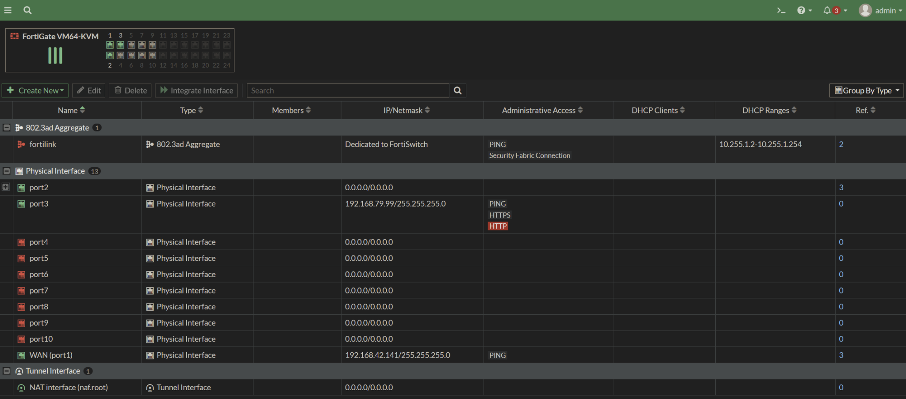
</p>

Sobre `port2` se configuraron las VLAN 10, 20 y 30 con sus respectivos gateways.

<p align="center">
  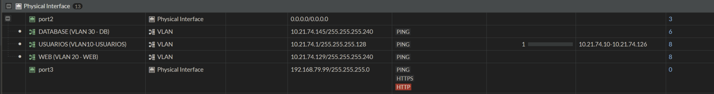
</p>

---

### Prueba 02 — VLANs, trunk y Port Security en el switch

El switch transporta las VLAN 10, 20 y 30 mediante un enlace trunk 802.1Q hacia FortiGate.

<p align="center">
  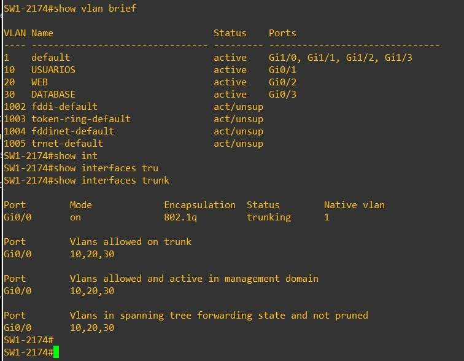
</p>

También se implementó Port Security en los puertos de acceso mediante Sticky MAC y modo de violación restrict.

<p align="center">
  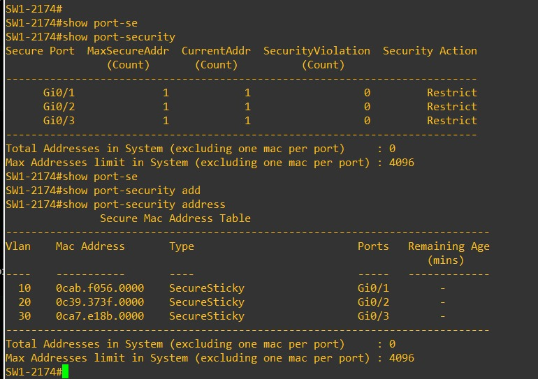
</p>

---

### Prueba 03 — DHCP para VLAN de usuarios

La VLAN 10 utiliza el gateway `10.21.74.1/25`.

El servicio DHCP se encuentra habilitado con el rango:

```text
10.21.74.10 - 10.21.74.126
```

<p align="center">
  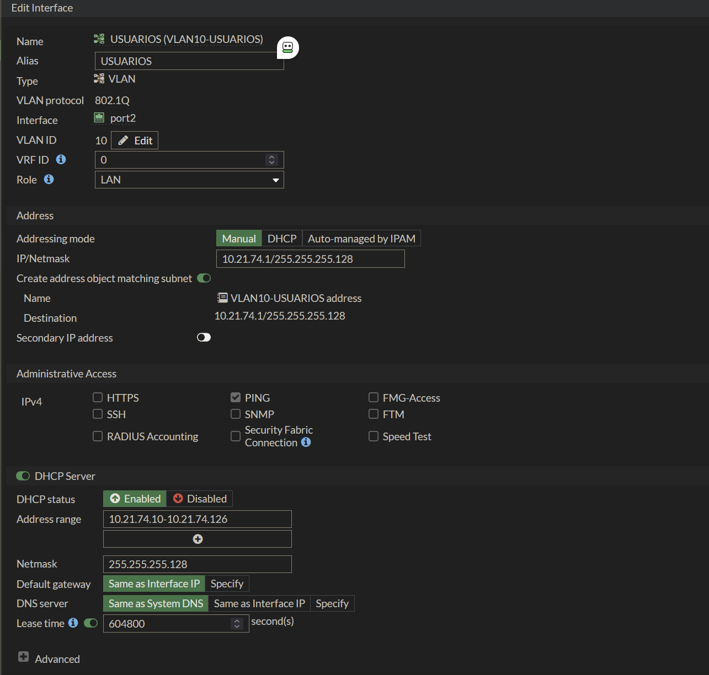
</p>

---

### Prueba 04 — WEB → DATABASE por MySQL

La política `WEB-TO-DB-MYSQL` permite únicamente el servicio MySQL desde el servidor WEB hacia el servidor DATABASE.

```text
WEB-SERVER → DB-SERVER
Servicio: MYSQL / TCP 3306
Acción: ACCEPT
```

<p align="center">
  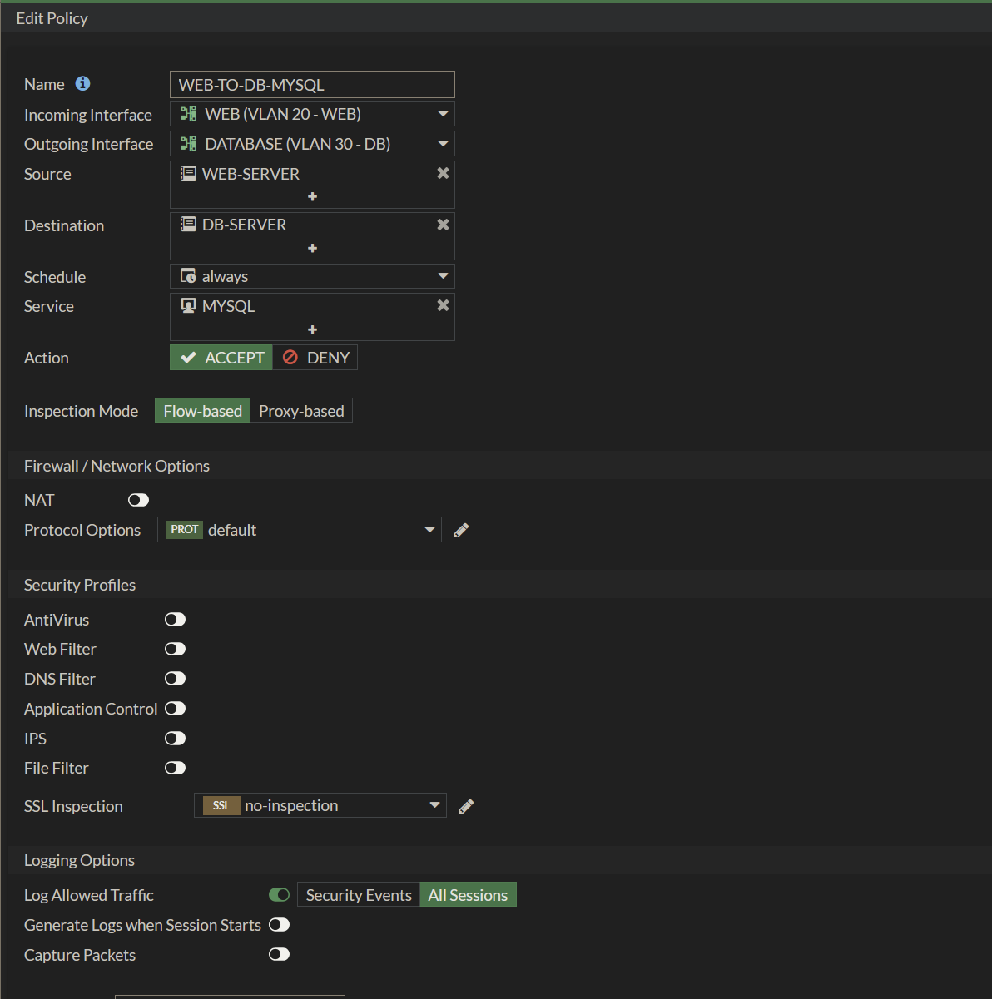
</p>

El resto del tráfico entre estos servidores es bloqueado mediante `BLOCK-WEB-TO-DB-OTHER`.

<p align="center">
  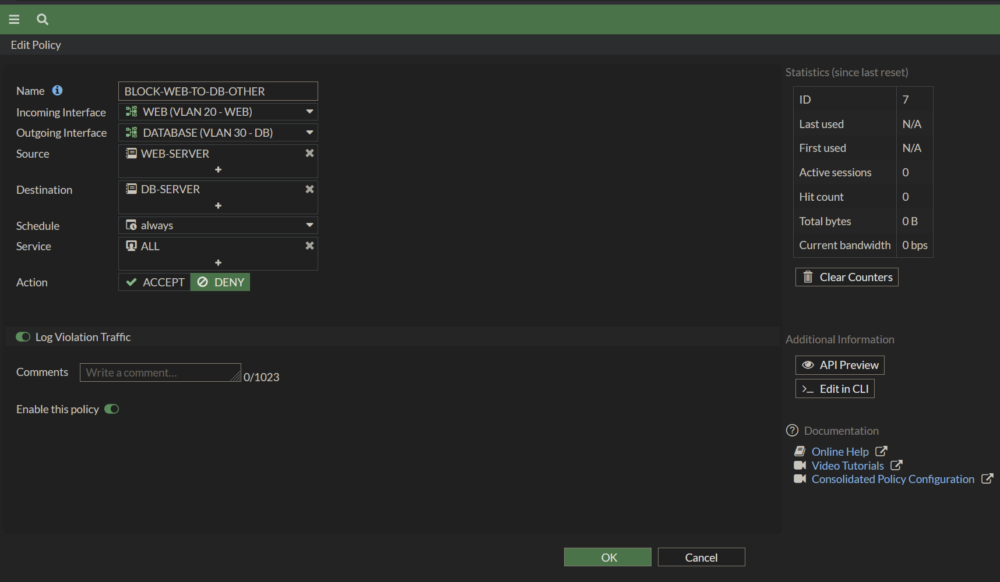
</p>

---

### Prueba 05 — Usuarios → Internet

La política `USUARIOS-TO-INTERNET` permite la salida de la VLAN de usuarios hacia la WAN mediante NAT.

También incorpora los perfiles:

- `APP-CONTROL-USUARIOS-2174`
- `BLOCK-EXE-2174`
- `certificate-inspection`

<p align="center">
  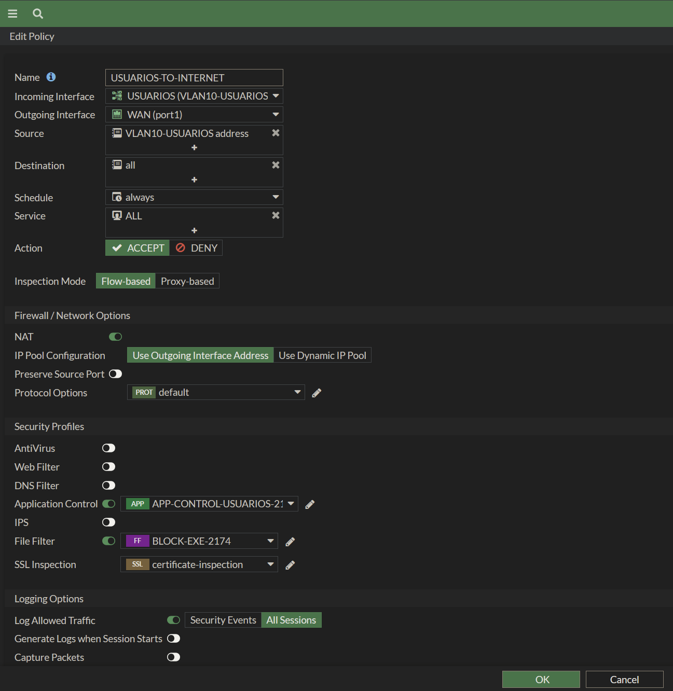
</p>

---

### Prueba 06 — Application Control

Se creó el perfil `APP-CONTROL-USUARIOS-2174`.

Entre los controles configurados se encuentran:

- P2P → Block
- Proxy → Block
- QUIC → Block
- otras categorías → Monitor / Pass según la configuración

<p align="center">
  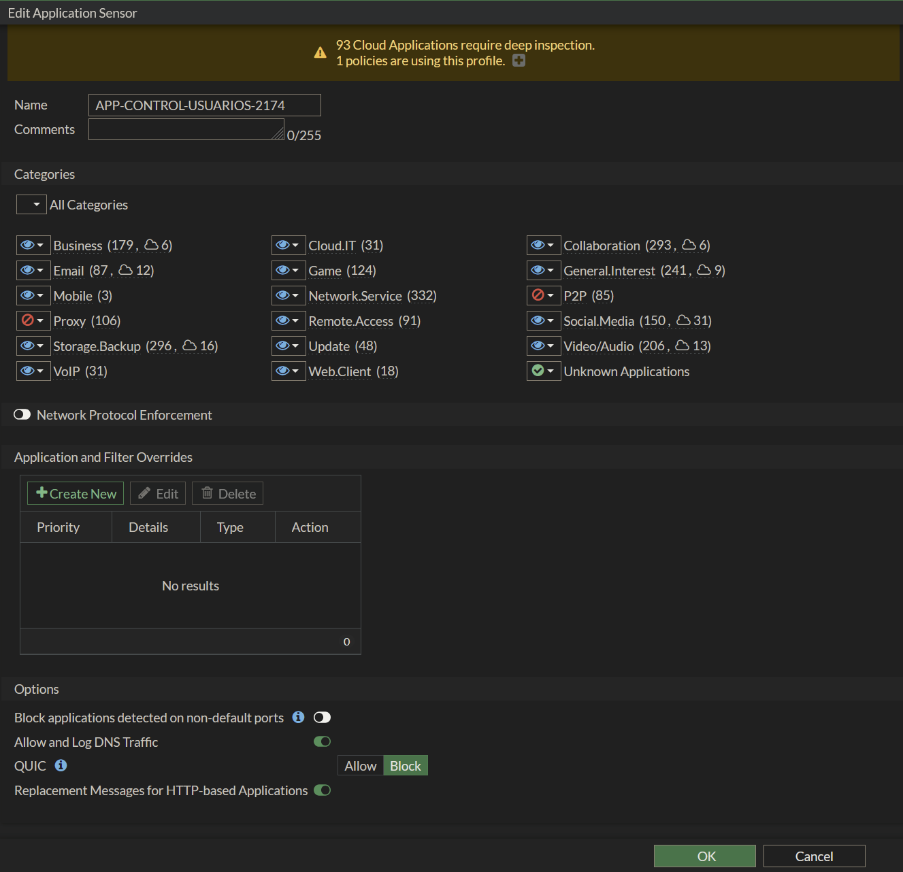
</p>

---

### Prueba 07 — SSL Deep Inspection

Se configuró el perfil `custom-deep-inspection` utilizando **Full SSL Inspection** y el certificado `Fortinet_CA_SSL`.

HTTPS se encuentra asociado al puerto TCP/443.

<p align="center">
  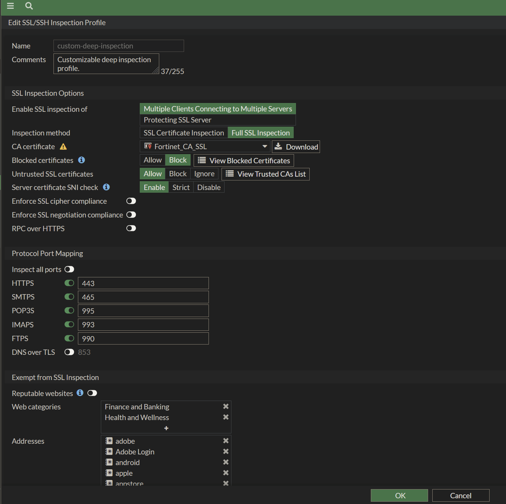
</p>

---

### Prueba 08 — IPS y SQL Injection

Se creó el sensor:

```text
SQLI-QUARANTINE-2174
```

El sensor utiliza la firma personalizada `SQLI-2174`, tiene Packet Logging habilitado y aplica una cuarentena temporal de 5 minutos.

<p align="center">
  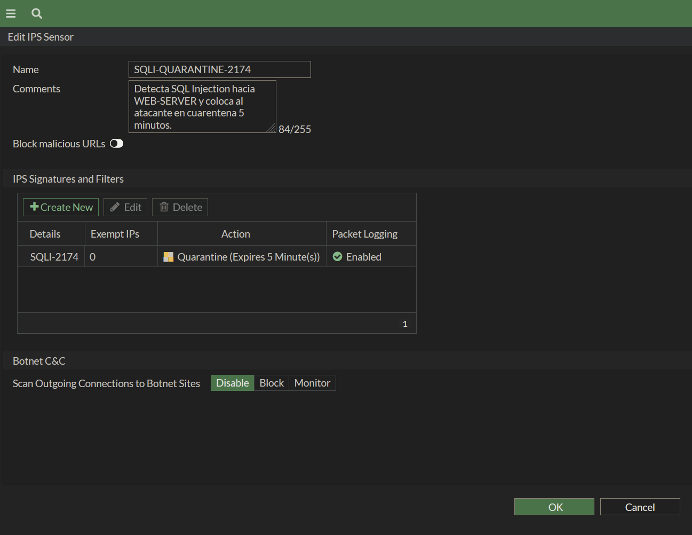
</p>

La firma personalizada analiza tráfico TCP originado por el cliente y detecta el patrón codificado:

```text
%20UNION%20SELECT%20
```

<p align="center">
  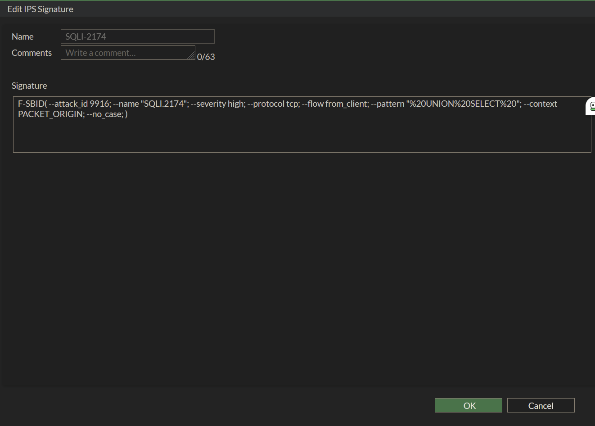
</p>

Para realizar la prueba controlada se utilizó:

```bash
curl -v "http://10.21.74.130/?id=1%20UNION%20SELECT%201,2,3"
```

FortiGate detectó la solicitud y devolvió el mensaje:

```text
Attack Detected
Blocked because of an intrusion attack
```

<p align="center">
  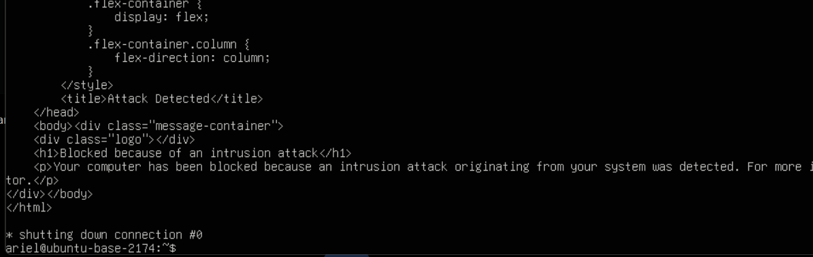
</p>

Después de la detección, la IP del equipo de usuarios `10.21.74.10` fue colocada temporalmente en cuarentena por el IPS.

<p align="center">
  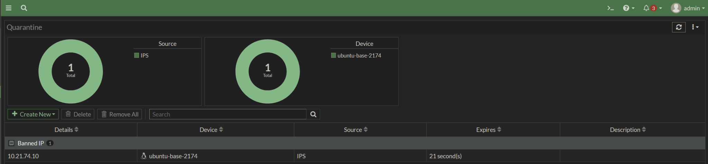
</p>

---

### Prueba 09 — Usuarios → WEB por HTTPS

Desde el equipo ubicado en VLAN 10 se verificó el acceso al servidor WEB mediante HTTPS.

Comando utilizado:

```bash
curl -k -I https://10.21.74.130
```

El servidor respondió:

```text
HTTP/1.1 200 OK
Server: Apache
Content-Type: text/html
```

<p align="center">
  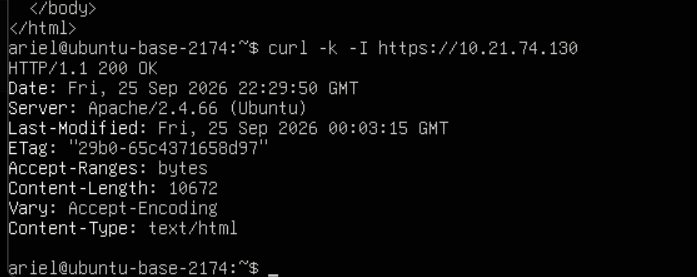
</p>

---

### Prueba 10 — Usuarios → DATABASE bloqueado

Se intentó conectar directamente desde la VLAN de usuarios hacia MariaDB:

```bash
nc -vz -w 3 10.21.74.146 3306
```

La conexión expiró debido a la política de bloqueo configurada en FortiGate.

<p align="center">
  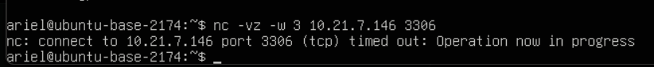
</p>

---

### Prueba 11 — WEB → DATABASE permitido únicamente por TCP/3306

Desde `WEB-SV-2174` se verificó conectividad hacia MariaDB:

```bash
nc -vz -w 3 10.21.74.146 3306
```

El resultado confirmó que TCP/3306 está permitido:

```text
Connection to 10.21.74.146 3306 port [tcp/mysql] succeeded!
```

<p align="center">
  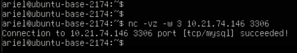
</p>

Para demostrar la restricción de otros servicios se probó TCP/22:

```bash
nc -vz -w 3 10.21.74.146 22
```

La conexión expiró, confirmando que el resto del tráfico queda bloqueado.

<p align="center">
  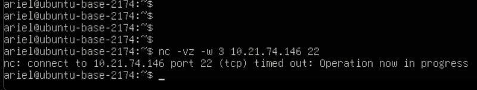
</p>

---

### Prueba 12 — File Filter y bloqueo de ejecutables

Se creó el perfil:

```text
BLOCK-EXE-2174
```

con la regla:

```text
BLOCK-WINDOWS-EXE
Traffic: Incoming
Protocol: HTTP
File Type: exe
Action: Block
```

<p align="center">
  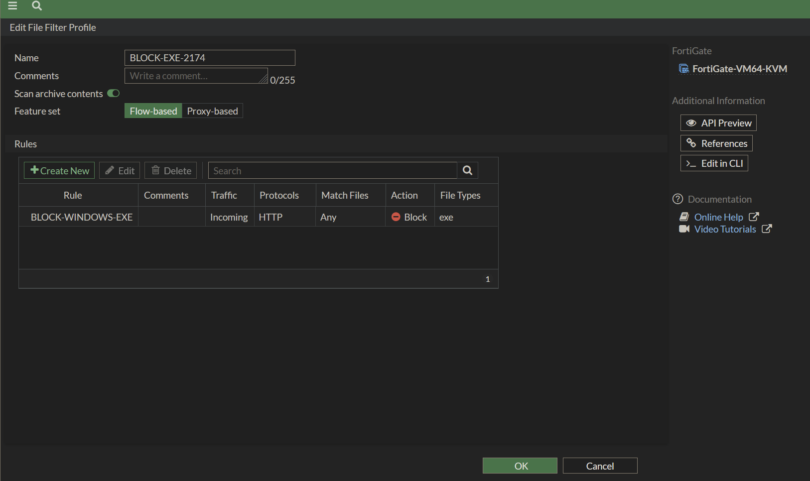
</p>

Desde el equipo de usuarios se intentó descargar un ejecutable Windows de prueba:

```bash
curl -v -o /tmp/prueba2174.exe http://10.21.74.130/prueba2174.exe
```

FortiGate interrumpió la transferencia.

<p align="center">
  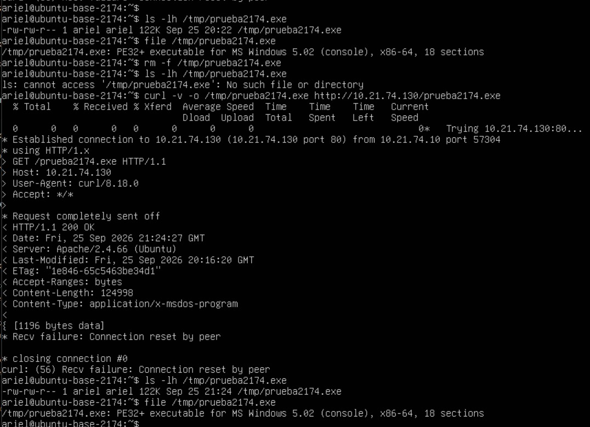
</p>

El evento quedó registrado en **Log & Report → File Filter** con:

```text
Action: blocked
File Name: prueba2174.exe
File Type: exe
Filter Name: BLOCK-WINDOWS-EXE
```

<p align="center">
  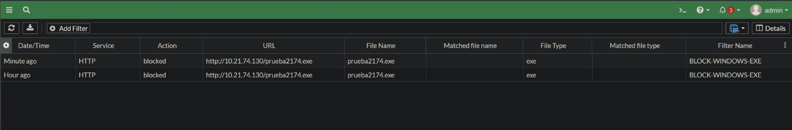
</p>

---

### Prueba 13 — Protección DoS

Se configuró la política:

```text
DOS-PROTECTION-WEB-2174
```

con protección y logging para anomalías como:

```text
tcp_syn_flood       Block     100
tcp_port_scan       Block      50
tcp_src_session     Block     100
tcp_dst_session     Block     200
icmp_flood          Block      50
```

<p align="center">
  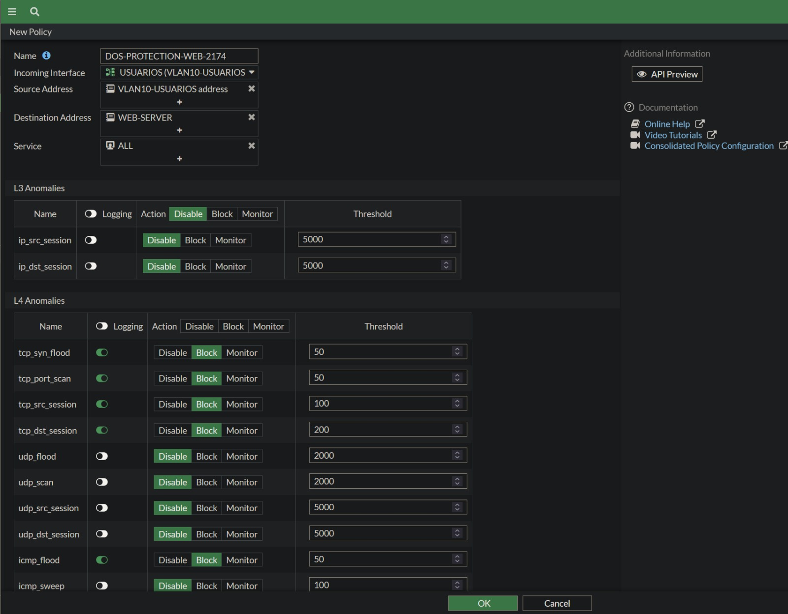
</p>

Para comprobar la protección se generó tráfico SYN controlado dentro del laboratorio:

```bash
sudo hping3 -S -p 443 -i u5000 -c 300 10.21.74.130
```

La prueba generó una pérdida significativa de respuestas una vez superado el threshold configurado.

<p align="center">
  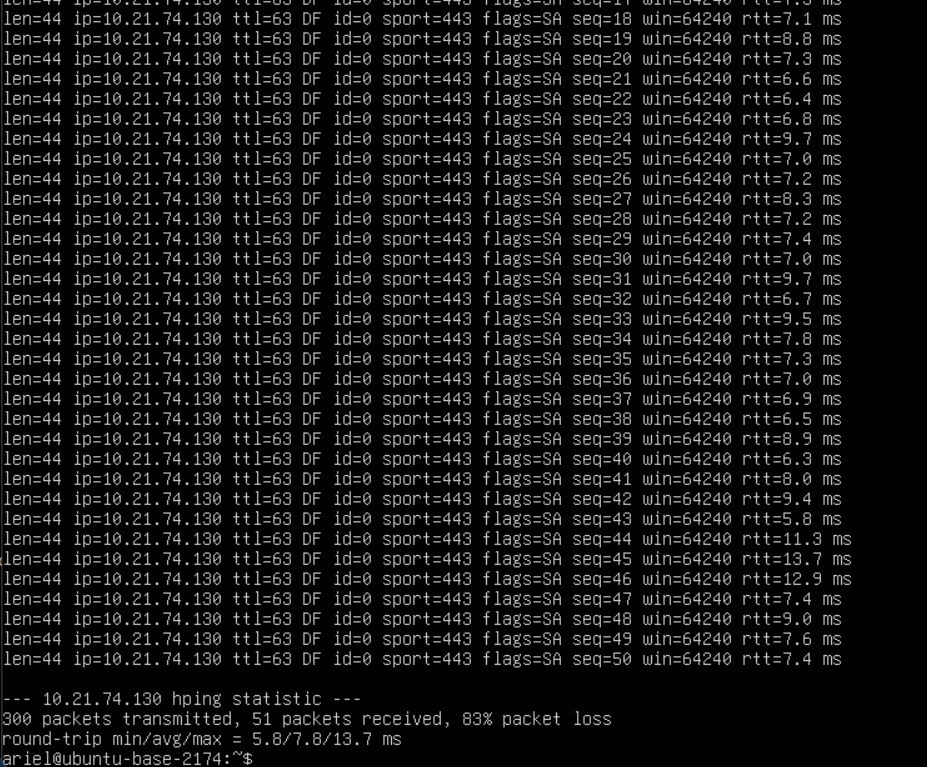
</p>

FortiGate registró el evento como:

```text
Source: 10.21.74.10
Attack Name: tcp_syn_flood
Action: clear_session
```

<p align="center">
  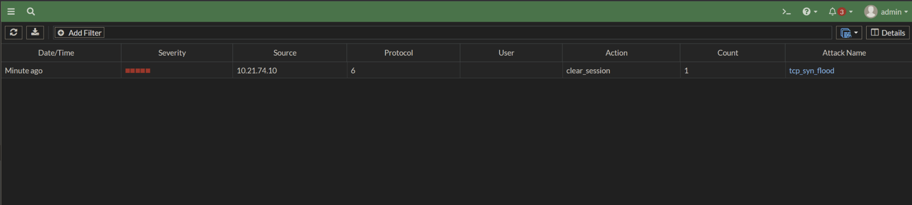
</p>

---

## 📸 Capturas de pantalla

Todas las evidencias utilizadas en la documentación se encuentran en el directorio `images/`.

```text
images/
├── 01_topologia_gns3.png
├── 02_interfaces_fortigate.png
├── 03_vlans_fortigate.png
├── 04_switch_vlans_trunk.png
├── 05_switch_port_security.png
├── 06_dhcp_usuarios.png
├── 07_politica_web_db.png
├── 08_bloqueo_web_a_db_other.png
├── 09_politica_usuarios_internet.png
├── 10_app_control_profile.png
├── 11_ssl_inspection.png
├── 12_ips_sqli_profile.png
├── 13_custom_signature_sqli.png
├── 14_sqli_attack_detected.png
├── 15_sqli_quarantine_monitor.png
├── 16_prueba_usuario_web_https.png
├── 17_prueba_usuario_db_bloqueado.png
├── 18_prueba_web_db_mysql.png
├── 19_prueba_web_db_otros_bloqueados.png
├── 20_file_filter_profile.png
├── 21_prueba_exe_bloqueado.png
├── 22_log_exe_bloqueado.png
├── 23_dos_policy.png
├── 24_prueba_dos.png
└── 25_log_dos.png
```

---

## 📁 Archivos del repositorio

La estructura final del repositorio es:

```text
SR-PRACTICA-1-/
├── README.md
├── images/
│   └── evidencias del laboratorio
├── files/
│   ├── fortigate-running-config.conf
│   └── switch-running-config.txt
└── scripts/
    ├── db-setup.sql
    ├── prueba2174.c
    └── test-commands.sh
```

### Running-configs

La configuración final de FortiGate está disponible en:

[Ver configuración de FortiGate](files/fortigate-running-config.conf)

La configuración final del switch está disponible en:

[Ver configuración del switch](files/switch-running-config.txt)

---

## ⚠️ Limitaciones observadas

Durante el laboratorio se configuró Full SSL Inspection mediante el perfil `custom-deep-inspection`.

Sin embargo, durante las pruebas HTTPS el cliente continuó observando el certificado autofirmado original del servidor WEB. Debido a esta limitación de la instancia utilizada, la comprobación funcional de la firma IPS personalizada para SQL Injection se realizó mediante una política HTTP temporal y controlada.

Esta política de prueba quedó deshabilitada al finalizar la validación.

También se utilizaron políticas temporales de acceso a Internet para instalar y actualizar paquetes en los servidores. Estas políticas permanecen deshabilitadas en la configuración final.

---

## ✅ Estado final del proyecto

La implementación y las validaciones técnicas principales fueron completadas correctamente.

Se comprobaron:

- Segmentación mediante VLAN 10, 20 y 30
- Trunk 802.1Q
- Port Security
- DHCP para usuarios
- NAT y salida a Internet
- Acceso Usuarios → WEB mediante HTTPS
- Bloqueo Usuarios → DATABASE
- Acceso WEB → DATABASE únicamente por TCP/3306
- Bloqueo de otros servicios WEB → DATABASE
- Application Control
- SSL Inspection
- IPS con firma personalizada
- detección de SQL Injection
- bloqueo de SQL Injection
- cuarentena del atacante
- File Filter para ejecutables `.exe`
- registro del bloqueo de archivos
- protección DoS
- detección de `tcp_syn_flood`
- exportación de running-config de FortiGate
- exportación de running-config del switch

### Pendiente

Únicamente queda agregar al inicio del README el enlace definitivo del video demostrativo una vez sea publicado.

---

## 📁 Archivos del repositorio

```text
FortiGate-Security-Lab-2174/
├── README.md
├── images/
├── files/
│   ├── fortigate-running-config.conf
│   ├── switch-running-config.txt
│   └── README.md
└── scripts/
    ├── db-setup.sql
    ├── prueba2174.c
    └── test-commands.sh
```

---

## ⚠️ Limitaciones observadas

La configuración de Full SSL Inspection quedó creada, pero durante la comprobación TLS el cliente siguió observando el certificado autofirmado original del WEB Server.

Para validar de forma reproducible la firma IPS, el bloqueo y la cuarentena se utilizó una policy HTTP temporal exclusivamente para la demostración. Esta policy queda deshabilitada en el estado final.

---
